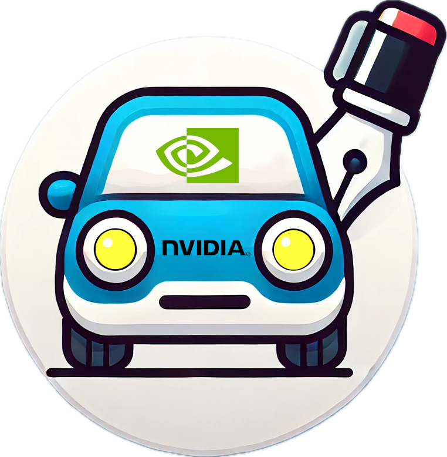

<h1 align="center">
  
  SIL-Wheel
</h1>
<p align="center"><b>A Multi-Modal Search and Curation Platform for Physical AI</b></p>

[](LICENSE)
[](https://www.python.org/downloads/release/python-3120/)
[](https://arxiv.org/abs/)

<p align="center">
  <a href="#installation">How to Install</a>
  &nbsp;✦&nbsp;
  <a href="https://research.nvidia.com/labs/sil/projects/sil-wheel-docs/index.html">Detailed Documentation</a>
  &nbsp;✦&nbsp;
  <a href="https://research.nvidia.com/labs/sil/projects/sil-wheel-docs/tutorials.html">Tutorials &amp; Recipes</a>
  &nbsp;✦&nbsp;
  <a href="#paper">Technical Report</a>
</p>

<p align="center">
  
</p>

SIL-Wheel is a framework for searching, curating, and evaluating
large-scale video datasets. It combines multiple search modalities,
including caption full-text search, caption and video embedding
retrieval, visual region search, ego-trajectory shape and pattern
matching, world-model filters, metadata filters, and classifier scores.

Searches in SIL-Wheel are composable: users can combine any number of
modalities and filters in a single query, and Wheel returns only the
clips that satisfy all active constraints. Retrieved clips can then be
validated, annotated, curated into datasets or benchmark slices, and
used for model evaluation within the same system.

## Key Features

- **Composable multi-modal search.** Combine caption full-text search,
  caption embeddings, video embeddings, visual region search,
  trajectory shape and pattern matching, classifier scores, metadata
  filters, and world-model filters in a single query.

- **Flexible data ingestion.** Load videos and metadata from the
  **Hugging Face Hub**, the **local filesystem**, or **S3** using the
  same pipeline.

- **End-to-end preprocessing pipeline.** Ready-to-run scripts under
  `scripts/` support video transcoding, caption generation, embedding
  extraction, trajectory statistics, clustering, and index construction.
  Supported embedding backends include Cosmos-Embed1, Qwen3-VL,
  PE-Core, and Florence2+SigLIP.

- **Web UI and Python clients.** Use the full-featured **Web UI** for
  browsing, annotating, curating, and running model arenas, or query
  Wheel programmatically through `WheelClient` and `WheelHTTPClient`.
  Both interfaces use the same search composition, ranking, and caching
  logic.

- **Closed-loop data curation.** Move from **search → validation →
  curation → evaluation** in a single framework: retrieve candidate
  clips, validate them through manual annotation or VLM Judge, curate
  slices using classifiers and clustering, and evaluate models on the
  resulting slices.

- **Agentic workflows.** Higher-level natural-language workflows can
  call the same search, annotation, curation, and evaluation primitives
  exposed by the Wheel service.

## Getting Started

```bash
git clone https://github.com/nv-tlabs/sil-wheel.git
cd sil-wheel
conda env create -f environment.yml
conda activate wheel

python setup.py build_ext --inplace
pip install -e .

# Launch your Wheel server
# This assumes the artifacts referenced in the YAML already exist.
python scripts/launch_server.py config/wheel_launch_dev_server_config.yaml
```

Open the bind address printed at startup (defaults to the
`server.bindto` value in the YAML) in a browser.

## Programmatic Access

Wheel can also be used directly from Python. It provides two clients:

- `WheelClient` for local access, when your Python process can directly
  read the datasets, indices, metadata, and artifacts referenced in the
  launch YAML.
- `WheelHTTPClient` for remote access, when you want to connect to a
  running Wheel server over HTTP.

### Local Client

Use `WheelClient` when running in the same environment as the indexed
artifacts.

```python
from sil_wheel.client import WheelClient

client = WheelClient.from_config("config/wheel_launch_dev_server_config.yaml")

# Single-modality search via a convenience helper.
result = client.search_caption("hard braking at intersection")
print(len(result), "clips matched")
# first 10 clip_ids
print(result.head(10))

# Compose multiple modalities and filters in one query, fused with RRF.
result = client.search(
    # caption FTS
    search="hard braking at intersection",
    # text->video embedding
    semantic_search_text="hard braking at intersection",
    data_source=["nuscenes"],
    rank_mode="rrf",
)
# per-clip per-modality scores
df = result.as_dataframe()
print(df.head(10))
```

### HTTP Client

Use `WheelHTTPClient` when connecting to an already running Wheel server.
The client surface is identical to `WheelClient`; the only difference is
that `result.scores` is empty for remote results (the server returns clip
IDs only), so use `result.clip_ids` directly.

```python
from sil_wheel.http_client import WheelHTTPClient

client = WheelHTTPClient(
    server_url="http://wheel-host:8012",
    username="alice",
    password="...",
)

result = client.search_caption("hard braking at intersection")
print(result.clip_ids[:10])

# Or copy a URL straight out of the UI's address bar:
result = client.search_from_url(
    "http://wheel-host:8012/?search=hard+braking&data_source=nuscenes"
)
```

Full client surface, search composition, and ranking modes are in the
[online documentation](https://research.nvidia.com/labs/sil/projects/sil-wheel-docs/index.html).

## Installation

The conda environment carries the heavy dependencies:

```bash
conda env create -f environment.yml
conda activate wheel
python setup.py build_ext --inplace
pip install -e .
```

To stream videos directly from S3, install the AWS CLI:

```bash
pip install awscli
```

Several embedding and captioning models are pulled from the Hugging
Face Hub on first use. Authenticate so gated checkpoints (e.g.,
Cosmos-Embed1) are reachable:

```bash
pip install --upgrade huggingface_hub
hf auth login
```

`flash-attn` has compatibility issues with CUDA 13.0 + PyTorch 2.10.
We recommend skipping it; PyTorch's fallback is slightly slower but
fine for debugging.

PE-Core (`pe_core_*` embedding types in
`extract_video_text_embeddings.py`) needs Meta's
[`perception_models`](https://github.com/facebookresearch/perception_models)
package. Install it **after** the conda environment is set up, and
with `--no-deps` so it does not downgrade `transformers` or other
packages already installed by the conda environment:

```bash
pip install --no-deps git+https://github.com/facebookresearch/perception_models.git
```

Skip this step if you don't plan to extract or evaluate `pe_core_*`
embeddings.

## QuickStart with SIL-Wheel

The fastest way to see Wheel end-to-end is the **nuScenes mini**
walkthrough under
[`examples/getting-started-nuscenes/`](examples/getting-started-nuscenes/).
A single script downloads the public nuScenes mini split, runs the
full pre-processing pipeline, builds every index, and starts a server
with every modality populated. About **2 hours on a single 4090**, no
AWS account required.

```bash
python examples/getting-started-nuscenes/setup_nuscenes.py
```

## Documentation

Full user and developer documentation is hosted at
[research.nvidia.com/labs/sil/projects/sil-wheel-docs](https://research.nvidia.com/labs/sil/projects/sil-wheel-docs/index.html).

In-repo references:

| Doc | Topic |
| :--- | :--- |
| [docs/data-preparation.md](docs/data-preparation.md) | Video processing, embeddings, metadata, and S3 upload |
| [docs/arena.md](docs/arena.md) | Blind model evaluation, manifest format, ELO ratings |
| [docs/bug-reporting.md](docs/bug-reporting.md) | Google-Sheets-backed bug-report form |

## Citation

If you use SIL-Wheel in your research, please cite:

```bibtex
@misc{sil-wheel,
  title  = {SIL-Wheel: A Multi-Modal Search and Curation Platform for Physical AI},
  author = {NVIDIA},
  year   = {2026},
  url    = {https://github.com/nv-tlabs/sil-wheel}
}
```

## Contributors

Maintained by the [NVIDIA SIL team](https://research.nvidia.com/labs/sil/).
This project is currently not accepting external contributions.
